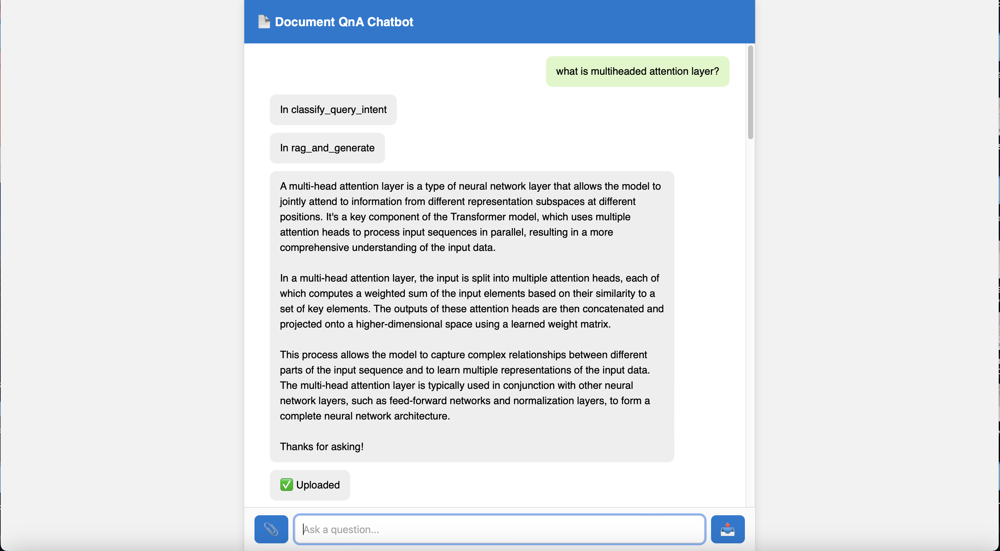
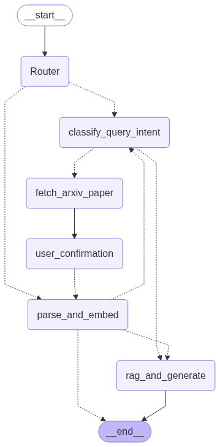

# 📄 Document QnA Agent 🤖

An interactive web-based AI chatbot that allows users to upload documents (PDF) and ask questions about their content. It uses an advanced **LangGraph-based multi-agent architecture**, **RAG (Retrieval-Augmented Generation)**, and **human-in-the-loop interrupt handling** — all wrapped in a clean web UI.

## 🎨 Images



## 🧠 Agent Workflow



## 🚀 Features

- 📎 Upload and parse PDF documents 
- 💬 Ask natural language questions based on the document
- 🧠 Powered by a LangGraph-based intelligent agent
- ⚡ Parses text, tables, using PyMuPdf and captions Images using the VLM.
- 🔍 **RAG pipeline** with:
  - ✅ Query Expansion (auto-enhanced search intent)
  - 🧠 ChromaDB vector store (document indexing)
  - 🎯 Cross-encoder reranking (semantic accuracy boost) 
- 🔁 Human-in-the-loop interrupt/resume flow for paper fetching using Arxiv API
- 🌐 Simple and responsive web UI (Flask + Vanilla JS)


---

## 🛠️ Tech Stack

| Component                | Library/Tool                             |
|--------------------------|------------------------------------------|
| Agent Workflow           | LangGraph, LangChain   |
| Vector Database (RAG)    | [ChromaDB](https://www.trychroma.com/) + HuggingFace Embeddings    |
| Query Expansion                      | Custom logic                            |
| Reranking     | cross-encoder/ms-marco-MiniLM-L-6-v2                            |
| Document Parsing              | PyMuPDF |
| Web App         | Flask + Vanilla JS           |
|LLM              | groq: llama-3.1-8b-instant          |

---

## 📦 Setup Instructions

### 1️⃣ Clone the Repository

```bash
git clone https://github.com/your-username/Document-QnA-Agent.git
cd Document-QnA-Agent
```

### 2️⃣ Install Dependencies
```bash
pip install -r requirements.txt
```

### 3️⃣ Run the Application
```bash
python app.py
```

